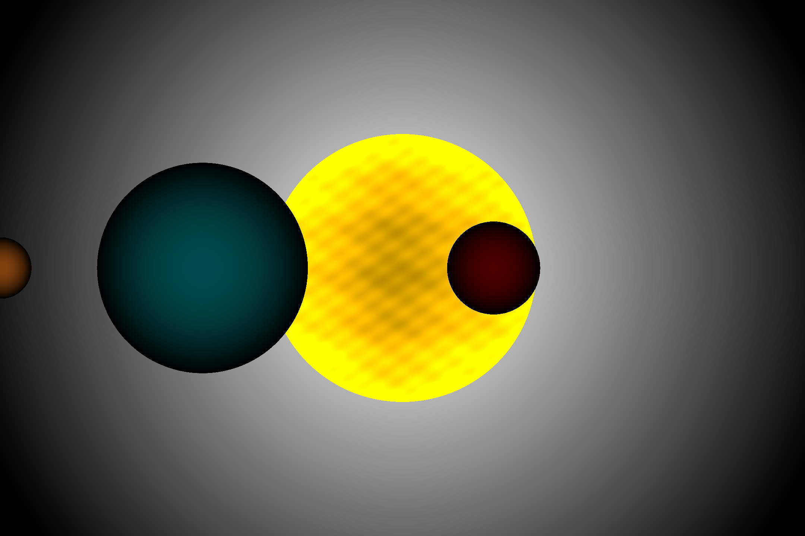
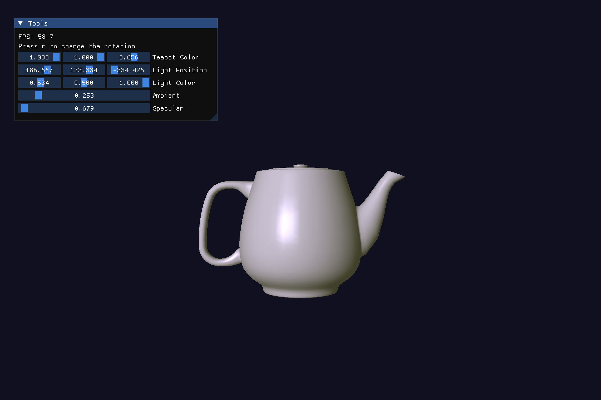

# Game Engine

Graphical libraries made from scratch using only C++ and OpenGL.It can be used to render both 3D and 2D objects, build UI'S and load shaders for more advanced visual effects. The framework it's still very bare bones, and more complex tasks may still need some extra coding lines. But i still make adjustments to make the framework better. The current framework was also used for brain MRI rendering in my Bachelor Thesis.

## What's new?

- Added support for .obj files
- Added StringTokenizer

## Tumor Slicing

|  |  |
|---|---|
|  |  |

## Installation Guide

### Windows

There's no installation guide for windows right now, but you can still copy the repository and import the headers and the source files to you project. Before actually using the engine you need to change the default filepaths inside the mesh.cpp and shaders.cpp files to actually match the Windows paths format.

```cpp
// Inside mesh.cpp
Mesh *ShapeRegistry::getShape(SHAPE_NAME name, SHADER_TYPE type,
                              DEFAULT_SHADER shader_name, bool saveData) {
    std::string id = std::to_string(name) + "_" + std::to_string(type);
    if (exists(id)) {
        return this->meshes[id];
    }


    // Change this to your resource directory
    std::string home = std::getenv("HOME");
    std::string path = home + "/.game-engine/default_mesh/";
//....

//Inside shader.cpp
Shader *Shader::ShaderCreator::createShader(DEFAULT_SHADER shaderName,
                                            SHADER_TYPE type,
                                            COORDINATES_FORMAT format) {

    //Same here
    std::string home = std::getenv("HOME");
    std::string pathVertex = format == COORDINATES_XYZ
                                 ? home + "/.game-engine/default_shaders/xyz/"
                                 : home + "/.game-engine/default_shaders/xyzw/";
    std::string pathFragment =
        home + "/.game-engine/default_shaders/fragments/";
//....
```

### Linux

#### Start by installing the required packages

##### Debian and Debian derivatives (Ubuntu, PopOs, Kali Linux...)

```bash
sudo apt install --no-install-recommends build-essential git gcc cmake make libglew-dev libglm-dev libglfw3-dev
```

##### Arch and Arch derivatives (EndeavorOS, Manjaro, Garuda...)

```bash
sudo pacman -S --needed base-devel git gcc cmake make glew glm glfw
```

#### Clone the repository

```bash
git clone https://github.com/TRBogdann/Game-Engine.git && cd ./Game-Engine
```

#### Run the install script

```bash
chmod +x install.sh
./install.sh
```

Then you can call the libraries inside your own program

## Exemples

### Creating an empty window

```cpp
#include <GameEngine/Graphics/graphics.h>

int main(void) {
    Program program;
    program.start();
    Window window("MyApp", 800, 800);
    program.useWindow(window);
    Event event;

    if (program.CheckForError())
        return 1;

    window.setColor(0, 100, 100, 255);

    while (!window.isClosed()) {
        window.clear();
        window.pollEvents(event);
        window.swap();
    }

    program.terminate();
    return 0;
}
```

### Exemples folder

You can check the exemples folder for some, not very impressive, programs created using my framework. They are still a good starting point tho.

### Running the demos

In order to create the executable you must create your own build using cmake. Let's take exemples/window for exemple.

In order to create the program:

```bash
cd exemples/window
mkdir build
cd build
cmake .. && make && cd ../
```

Then you can run the executable like this:

```bash
./build/program
```

#### exemples/camera

- Rendering shapes using float data.
- Modifying the vertex buffer
- Camera controls
- Default render methods


#### exemples/cubes

- Using default meshes (ShapeRegistry)
- Applying textures
- Rendering multiple objects
  


#### exemples/terrain

- Rendering surfaces


#### exemples/solar_system

- Defining and using custom shaders
- Creating a canvas using a flat surface
- Rendering without a camera



#### exemples/light

- Rendering .obj
- Creating ambient light
- Creating diffusal light
- Creating specular light
- Phong reflection model (ambient + diffusal + specular)


#### exemples/utah

Added:

- Normal Matrix in shader to account for the rotations

It's a continuation of the previous exemples and it's a real time light simulation.
It offers a GUI that let's you adjust the ambient light, reflections, light source position and light color in real time and helps you understand how light works in the real world.

|  |  |
|---|---|
|  |  |

#### Projects that use my engine

##### Brain volume rendering and segmentation

Part of my bachelor thesis. You can find the link bellow.

[Thesis](https://github.com/TRBogdann/Licenta)


## Free and open-source

You can modify the code and use it in your own programs however you like. You can even use it as a starting point for your own Game Engine.
